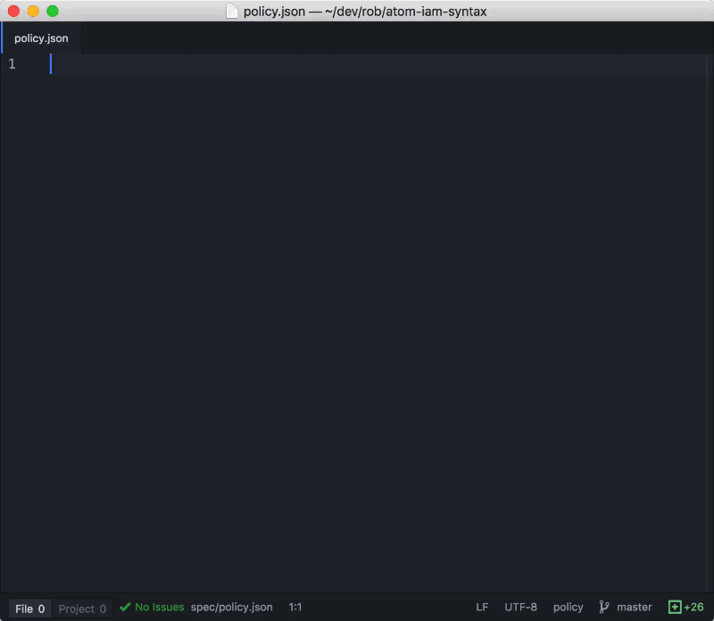

# Atom IDE IAM Policy Syntax Highlighting

Action aware syntax highlighting and snippets for AWS IAM Policies in the Atom IDE.



**Features:**
* **Strict Syntax Highlighting** - discover errors early with the [IAM EBNF](http://docs.aws.amazon.com/IAM/latest/UserGuide/reference_policies_grammar.html#po)
* **Block Snippets** Autogenerate `Id`, `Version` and `Statement`
* **Action Snippets** Never miss an action again across all _86_ services  e.g.:
 * `logs:<tab>` autocompletes to all cloudwatch logs actions
 * `xray:<tab>` autocompletes to all xray logs actions
* **Condition Snippets** better scope your policies e.g.
 * `IpAddress<tab>`
 * `IpAddressIfExists<tab>`
* **Autogenerated Grammars** This grammar autoscales with AWS!

## Development Notes

**Generating Grammars**

Because AWS Services and available actions change often, so too must our grammar.  We autogenerate the grammar with the provided script

```bash
cd ./lib
bundle install
bundle exec generate-grammars.rb
```

**Extracting The Service map**
* The service map is extracted from the [AWS Policy Generator](https://awspolicygen.s3.amazonaws.com/policygen.html) which stores a javascript object of all service information in the [policies.js file](https://awsiamconsole.s3.amazonaws.com/iam/assets/js/bundles/policies.js).
* This object can also be accessed from within the developer console of the policy generated via: `app.PolicyEditorConfig.serviceMap`

**Atom Grammar Development**
* ⌘+⌥+p -- show current scope
* ⌘+⇧+p -> Window: Reload -- needed to reprocess your changes
* `apm link $SYNTAX_FOLDER` -- install a syntax repo into atom

## Resources

Resources:
* [IAM Policy Generator](https://awsiamconsole.s3.amazonaws.com/iam/assets/js/bundles/policies.js)
* [IAM Grammar](http://docs.aws.amazon.com/IAM/latest/UserGuide/reference_policies_grammar.html#policies-grammar-bnf)
* [TextMate Grammar Docs](http://manual.macromates.com/en/language_grammars)
* [Writing a Syntax Highlighting Package](https://www.sitepoint.com/how-to-write-a-syntax-highlighting-package-for-atom/)

Thanks:
* The Atom Team and [Lee Dohm](https://github.com/lee-dohm) for building [great templates](https://github.com/atom/language-json)
